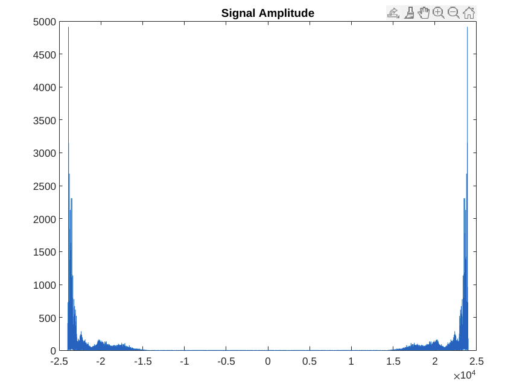

# DSB-LC

    <h1>Ahmed Asaad Sec: 1 B.N: 1</h1>

    <h1><a href="https://github.com/ahmedasad236/DSB-LC">Source Code</a></h1>
    

    <h2>Figures</h2>

<h3>Message Signal</h3>

<ul>
    <li>
        <h3>Time Domain</h3>
        
    </li>
    <li>
        <h3>Spectrum</h3>
        
    </li>
    <li>
        <h3>Amplitude in Frequency Domain</h3>
        
    </li>
    <li>
        <h3>Phase in Frequency Domain</h3>
        
    </li>
</ul>

<h3>Modulated Signal</h3>
<ul>
    <li>
        <h3>Time Domain</h3>
        
    </li>
    <li>
        <h3>Spectrum</h3>
        
    </li>
    <li>
        <h3>Amplitude in Frequency Domain</h3>
        
    </li>
    <li>
        <h3>Phase in Frequency Domain</h3>
        
    </li>
</ul>

<h3>Demodulated Signal</h3>
<ul>
    <li>
        <h3>Time Domain</h3>
        
    </li>
    <li>
        <h3>Spectrum</h3>
        
    </li>
    <li>
        <h3>Amplitude in Frequency Domain</h3>
        
    </li>
    <li>
        <h3>Phase in Frequency Domain</h3>
        
    </li>
</ul>

    <h2>Explaination</h2>

<ul>
    <li>
        <h3>Chooseing A and w </h3>
        

            I have choosed A with the absolute of minimum value of the message m(t) divided by the modulation index (mu)., 
            For w, I have choosed it as the quarter of the sampling rate.
        

    </li>
    <li style="border-top: 1px solid white;">
        <h3>Problem with the AM signal when it is over-modulated</h3>
        
            It will cause error for asynchronous demodulation using envelope detector, as there will be part of the signal in the negative part and the envelope would not detect it.
        
    </li>
        <li style="border-top: 1px solid white;">
        <h3>Are the two signals, original and demodualted, the same?</h3>
        
            Yes, They are almost the same. As we apply synchronous Amplitude modulation using the same carrier in the demodualtor.
        
    </li>

</ul>